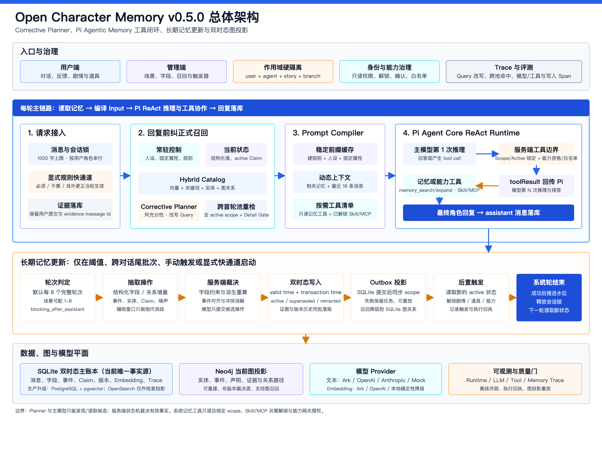

# Open Character Memory

[English](README.en.md) | [中文](README.md) | [Apache-2.0](LICENSE)

Open Character Memory is an open-source role-user memory runtime and visual studio for role-play companions and tutoring agents. It remembers user facts, character commitments, shared stories, corrections, relationship state, and narrative branches without treating every semantically similar memory as current truth.

Version `0.5.0` combines a Pi Agent Core ReAct loop with corrective and agentic memory retrieval, a bitemporal SQLite source of truth, a replayable Neo4j graph projection, and controlled Skill/MCP execution.



## Highlights

- Bidirectional user, character, and shared-story memory with strict user/agent/story/branch isolation.
- Event operations for `create`, additive `enrich`, real-world `update`, belief correction `supersede`, and `retract`, backed by valid and transaction time.
- Event/entity/claim graph visualization with pre-answer corrective retrieval and in-generation read-only memory tools.
- Configurable structured fields, extraction cadence, prompts, retrieval policy, plots, and low-code triggers.
- Scope-locked `memory_search` / `memory_expand`, controlled Skill/MCP exposure, execution receipts, and Pi `toolResult` continuation turns.
- Inspectable Trace views for prompts, injected memory, retrieval evidence, model/tool calls, and post-turn writes.
- A headless `memory-runtime/v1` contract with `observe / recall / expand / mutate / forget`, a persistent extraction queue, a typed JavaScript/TypeScript SDK, Pi and generic adapters, and a read-only MCP server.

## Market comparison

See the [2026 agent-memory comparison](docs/market-memory-comparison-2026.md) for a current review of TencentDB Agent Memory, Mem0, Zep/Graphiti, Letta, LangGraph, Hindsight, and the repository-memory approaches used by Codex, Claude Code, and Cursor. The report includes dated GitHub popularity and market-scale signals, plus an English executive summary.

## What is implemented

- Hard isolation by user, agent, story, and branch.
- Admin-defined structured memory fields with types, scopes, constraints, extraction instructions, and prompt templates.
- User-defined persistent response rules that pass server-side safety boundaries.
- Versioned claims with additive `enrich` plus `active`, `superseded`, and `retracted` states.
- Bitemporal `valid_*` and `transaction_*` intervals with `valid_at` / `known_at` as-of queries.
- Neo4j graph projection with tenant scope keys, idempotent replacement, outbox replay, and SQLite fallback.
- Pi Agent Core state, lifecycle events, and a ReAct-style tool loop. Read-only memory tools are routed only for memory-relevant turns and cannot accept client/model scope keys. Unlocked scoped props are exposed separately; validated declarative Skill tools and allowlisted MCP tools execute through the server gateway and return `toolResult` before the model continues.
- User memory plus role/user shared-story events, entities, claims, and evidence-backed relations.
- Three-layer retrieval: hybrid pre-retrieval builds a lightweight catalog and strict detail set; a Corrective Recall Planner can rewrite or decompose an insufficient query and search all active events in the server-locked scope, outside the initial intent pool; the main model can later call `memory_search` or `memory_expand` when it discovers an evidence gap. All results remain Active Only, and provisional shared-story memories still require direct evidence.
- A hybrid graph ontology: six broad entity classes, controlled core relation families, preserved concrete predicates, and open traceable extensions. First-person relational queries resolve the current user identity before traversing family, ownership, and evidence edges.
- Deterministic relationship retrieval emits a grounded answer contract containing the user anchor, requested relation family, resolved object, and active evidence edge. Conflicting historical assistant answers are excluded from that model turn, and the decision is visible in Trace.
- Conditional story unlocking and auditable function calls driven by structured state.
- Role prompt, memory injection, planner rewrites, cross-pool hits, scope-locked memory tool calls, model usage, and cache diagnostics in Trace.
- Read-only "no short-term memory" Trace replay: rerun the original query in the same scope while giving both the retrieval planner and main model zero recent dialogue messages. The diagnostic run writes only a new Trace and cannot persist messages or memory, fire triggers, advance plots, or execute Skill/MCP tools.
- Provider adapters for Ark, OpenAI, Anthropic, and an offline Mock mode.
- Stable-prefix caching: role instructions and fixed attributes are cacheable; server time, user state, retrieved memory, plots, and recent dialogue stay dynamic. A zero provider-managed `cached_tokens` value means the upstream reported no hit or no cache usage, not that a local cache failed.
- NDJSON chat streaming with turn resets for multi-step tool loops, plus sanitized GFM Markdown rendering. Routine memory-extraction start/completion stays silent and the completion event refreshes the progress ring directly.

## Quick start

Node.js 24 or later is required.

```bash
npm ci
npm run start:mock
```

Open `http://127.0.0.1:4173`. Mock mode requires no external account and uses `local-demo-admin-2026` as a local-only administrator password.

For a real provider:

```bash
cp .env.example .env.local
# Set TEXT_PROVIDER, EMBEDDING_PROVIDER, provider credentials, and a strong ADMIN_PASSWORD.
npm start
```

Docker Compose deliberately requires an explicit administrator password:

```bash
ADMIN_PASSWORD='replace-with-a-strong-secret' \
NEO4J_PASSWORD='replace-with-a-different-strong-secret' \
docker compose up --build
```

## Headless Memory Runtime

Existing Studio routes remain unchanged. Other agents can integrate through the versioned HTTP contract or the repository SDK:

```js
import { MemoryClient } from '@open-character-memory/sdk';

const memory = new MemoryClient({
  baseUrl: 'http://127.0.0.1:4173',
  apiKey: process.env.MEMORY_SERVICE_API_KEY
}).scope({
  tenantId: 'default',
  subjectId: userId,
  agentId,
  spaceId: storyId,
  branchId: 'main'
});

const contextPack = await memory.recall({ query: userText });
await memory.observe({
  idempotencyKey: turnId,
  threadId,
  extractionMode: 'async',
  messages: [
    { role: 'user', content: userText },
    { role: 'assistant', content: assistantText }
  ]
});
```

The service key is restricted to `/v1/memory/*`. Model-facing tools are read-only and receive no scope arguments; the application injects and locks scope on the server side. See [the headless runtime and SDK contract](docs/headless-memory-runtime.md) and [the OpenAPI document](openapi/memory-v1.yaml).

## Verification

```bash
npm test
npm run eval
npm run check:open-source
```

Tests and memory evaluations run without external model calls.
With real text and embedding providers configured, `npm run eval:long-term:real` reruns the cross-session trip-ordering and pet-care timeline cases. Each fact is seeded in a separate conversation and the final question keeps only its current message, so this command consumes real provider quota and measures long-term memory rather than short-term context.

## Cache boundary

The database, state machine, and prompt compiler remain the only source of truth. The cache stores only a provider context identifier for the stable prompt prefix. Its key contains the provider/model, agent, profile version, scene configuration version, and stable prompt hash. Any profile edit creates a new key. Cache failure falls back to a complete uncached request and never changes memory correctness.

Ark defaults to provider-managed caching reported by Responses usage. Explicit `common_prefix` Context caching remains opt-in for deployments configured with a compatible endpoint ID. Tool-bearing turns use Pi's native provider stream; adapter and native paths both preserve real usage and cache statistics. OpenAI reports provider-managed cached token usage. Anthropic marks the stable system block as ephemeral cache content.

## Storage boundary

SQLite is the current single-node source of truth. Neo4j is a rebuildable read projection for graph traversal, not a second authority. Embeddings remain JSON vectors scored in the application process. The JavaScript/TypeScript SDK and persistent single-node extraction jobs are implemented as an alpha workspace package; independent npm/PyPI publication, a Python SDK, PostgreSQL plus pgvector, and a distributed worker remain future work.

OpenSearch may become useful later as a hybrid lexical/vector retrieval index for large corpora, but it should not replace the transactional record or Neo4j path projection.

See [the runtime and graph design](docs/bitemporal-neo4j-pi-runtime.md), [the headless memory contract](docs/headless-memory-runtime.md), [the future storage roadmap](docs/future-storage-sdk-roadmap.md), and [the release checklist](docs/open-source-release-checklist.md).

## License

Apache License 2.0.
